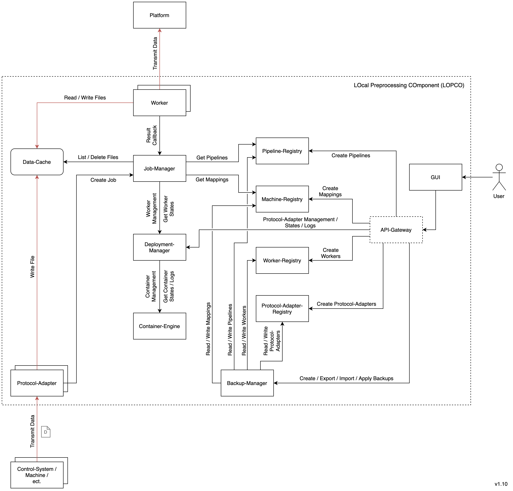

## lopco-core

LOPCO (LOcal Preprocessing COmponent) provides data processing automation via user defined pipelines and workers. Integration of LOPCO with local systems can be achieved with protocol-adapters. LOPCO provides a runtime environment, mechanisms and APIs for developers implementing workers or protocol-adapters.  

This repository contains the [core files](#lopco-core-files) required to deploy, update and configure LOPCO [services](#lopco-services).

---

#### LOPCO Services

- [Job-Manager](https://github.com/PlatonaM/lopco-job-manager)
- [Deployment-Manager](https://github.com/PlatonaM/lopco-deployment-manager)
- [Update-Manager](https://github.com/PlatonaM/lopco-update-manager)
- [Backup-Manager](https://github.com/PlatonaM/lopco-backup-manager)
- [Machine-Registry](https://github.com/PlatonaM/lopco-machine-registry)
- [Pipeline-Registry](https://github.com/PlatonaM/lopco-pipeline-registry)
- [Worker-Registry](https://github.com/PlatonaM/lopco-worker-registry)
- [Protocol-Adapter-Registry](https://github.com/PlatonaM/lopco-protocol-adapter-registry)
- [API-Gateway](https://github.com/PlatonaM/tinyproxy-env-conf)
- [GUI](https://github.com/PlatonaM/lopco-gui)

---

#### LOPCO Architecture

---

#### LOPCO Core Files

    lopco-core/
        |
        |--- docker-compose.yml
        |
        |--- updater.sh
        |
        |--- load_env.sh
        |
        |--- core.conf
        |
        |--- logs/
        |        |
        |        |--- updater.log
        |        |
        |        |--- ...
        |
        |--- .updater_com/
                 |
                 |--- ...

---

#### LOPCO Core Installation

Requirements:
 - bash
 - git
 - docker
 - docker-compose
 - systemd

Clone this repository to a preferred location (for example `/opt/lopco-core`):

    git clone https://github.com/PlatonaM/lopco-core.git

Navigate to the repository you just created and choose **one** of the options below.

 - Install automatic core updates and config loader:
	 - With root privileges run `./updater.sh install`.
 - Install config loader only:
	 - With root privileges run `./load_env.sh install`.

Reboot or reload your session for changes to take effect.

---

#### Configuration

The core updater and LOPCO services can be configured via the `core.conf` file:

 - `LOPCO_CORE_ENVIRONMENT` set to either `dev` for developemnt branch or `latest` for stable branch.
 - `LOPCO_LOG_LEVEL` set logging level for LOPCO [services](#lopco-services). (`debug`, `info`, `warning`, `error`)
 - `LOPCO_SUBNET` define the subnet of the docker-network. All LOPCO [services](#lopco-services), workers and protocol-adapters reside in this network.
 - `LOPCO_UPDATER_DELAY` determine how often (in seconds) the core updater checks if a LOPCO [service](#lopco-services) must be redeployed after it has been updated by the user.
 - `LOPCO_UPDATER_LOG_LVL` set logging level for core updater. (`0`: debug, `1`: info, `2`: warning, `3`: error)
 - `LOPCO_SELF_UPDATE_DELAY` set how often the [core files](#lopco-core-files) will be updated in seconds.
 - `LOPCO_UM_UPDATE_AUTOMATIC` enable `True` or disable `False` automatic checks for updates by the [Update-Manager](https://github.com/PlatonaM/lopco-update-manager) service.
 - `LOPCO_UM_UPDATE_SECOND` set the seconds (0-59) of the time when the [Update-Manager](https://github.com/PlatonaM/lopco-update-manager) service will check for updates.
 - `LOPCO_UM_UPDATE_MINUTE` set the minutes (0-59) of the time when the [Update-Manager](https://github.com/PlatonaM/lopco-update-manager) service will check for updates.
 - `LOPCO_UM_UPDATE_HOUR` set the hour (0-23) of the time when the [Update-Manager](https://github.com/PlatonaM/lopco-update-manager) service will check for updates.
 - `LOPCO_UM_UPDATE_INTERVAL` if the above options are set to 0 the [Update-Manager](https://github.com/PlatonaM/lopco-update-manager) service will check in the given interval (seconds).
 - `LOPCO_UM_CORE_DELAY` determines how often the [Update-Manager](https://github.com/PlatonaM/lopco-update-manager) service will check if the core updater has redeployed a service in seconds.
 - `LOPCO_UM_CORE_TIMEOUT` set how long the [Update-Manager](https://github.com/PlatonaM/lopco-update-manager) service should wait till a service is redeployed.
 - `LOPCO_JM_JOBS_CHECK` interval in seconds at which the [Job-Manager](https://github.com/PlatonaM/lopco-job-manager) service checks if a new job is available and can be executed.
 - `LOPCO_JM_JOBS_MAX_NUM` number of Jobs the [Job-Manager](https://github.com/PlatonaM/lopco-job-manager) service can execute in parallel.
 - `LOPCO_DM_DOCKER_DISABLE_RM` set to `True` if worker containers should persist after the worker is done. Default is `False`.
 - `LOPCO_BM_AUTOBACKUP_ENABLED` enable `True` or disable `False` if the [Backup-Manager](https://github.com/PlatonaM/lopco-backup-manager) service creates automatic backups.
 - `LOPCO_BM_AUTOBACKUP_SECOND` set the seconds (0-59) of the time when the [Backup-Manager](https://github.com/PlatonaM/lopco-backup-manager) service will create a backup.
 - `LOPCO_BM_AUTOBACKUP_MINUTE` set the minutes (0-59) of the time when the [Backup-Manager](https://github.com/PlatonaM/lopco-backup-manager) service will create a backup.
 - `LOPCO_BM_AUTOBACKUP_HOUR` set the hour (0-23) of the time when the [Backup-Manager](https://github.com/PlatonaM/lopco-backup-manager) service will create a backup.
 - `LOPCO_BM_AUTOBACKUP_INTERVAL` if the above options are set to 0 the [Backup-Manager](https://github.com/PlatonaM/lopco-backup-manager) service will create backups in the given interval (seconds).
 - `LOPCO_BM_AUTOBACKUP_MAX_DAYS` set the number of days automatic backups are retained by the [Backup-Manager](https://github.com/PlatonaM/lopco-backup-manager) service.
 - `LOPCO_GUI_PORT` port the [GUI](https://github.com/PlatonaM/lopco-gui) service will be available on.

---

#### Deploy LOPCO Services

To deploy the LOPCO [services](#lopco-services) go to the [core installation dictionary](#lopco-core-installation) and with root privileges issue the following command:

    ./updater.sh deploy

If any of the [config options](#configuration) change, the above command must be issued again to redeploy the affected services.
